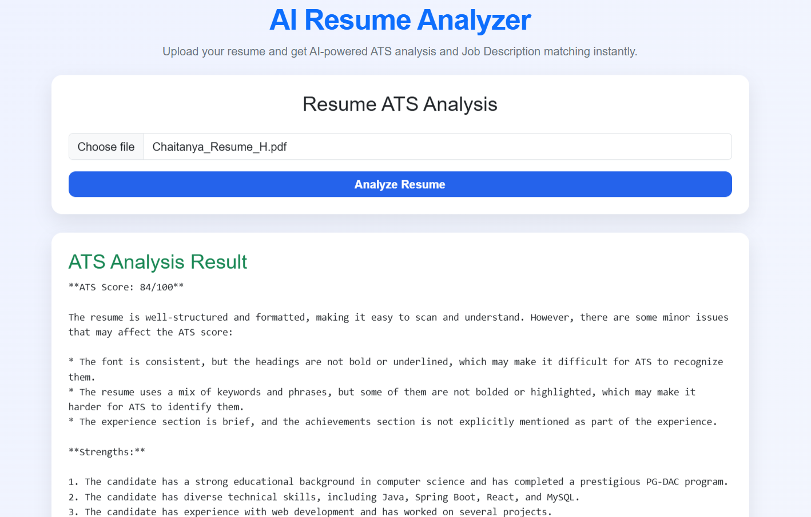
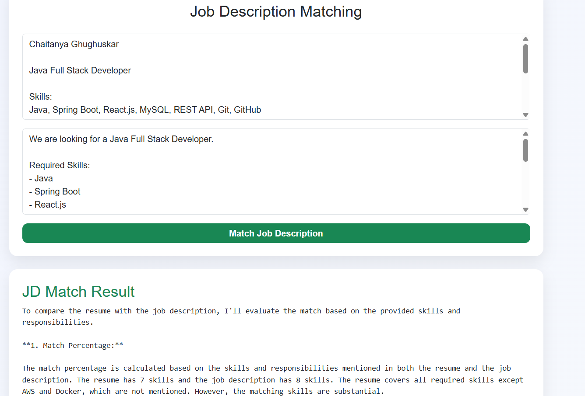

# AI Resume Analyzer 🚀

AI Resume Analyzer is a web application that helps job seekers improve their resumes using Artificial Intelligence.

Users can upload their resume, get an ATS (Applicant Tracking System) score, identify missing skills, 
receive improvement suggestions, and compare their resume with a job description.

---

## Features

✅ Upload Resume (PDF)

✅ ATS Score Analysis

✅ Resume Improvement Suggestions

✅ Job Description Matching

✅ Missing Skills Detection

✅ AI-Powered Recommendations

---

## Tech Stack

### Frontend

- React.js
- Bootstrap
- Axios
- Vite

### Backend

- Spring Boot
- Spring Security
- Spring Data JPA
- MySQL

### AI

- Groq AI (Llama 3.1)

### PDF Processing

- Apache PDFBox

---

## Screenshots

### ATS Analysis

### Job Description Matching

---

## How It Works

1. Upload Resume
2. Extract Resume Text
3. Analyze Resume using AI
4. Generate ATS Score
5. Match Resume with Job Description
6. Get Improvement Suggestions

---

## Future Enhancements

- Resume Builder
- Interview Question Generator
- Skill Gap Analysis
- Cloud Deployment

---

## Developer

**Chaitanya Ghughuskar**

📧 chaitanyaghughuskar@gmail.com

🔗 LinkedIn:
https://www.linkedin.com/in/chaitanya-ghughuskar/
